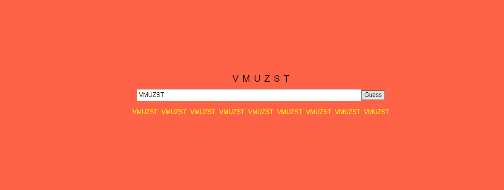

# Wordle Game

Wordle Game is a word guessing game with a simple 6x5 grid interface that has taken over the Internet as the most talked about word guessing game, with a vast player base of over 2 million daily players all over the world. This is just a simple version of it.

I'm gonna probably mess up alot and create weird things before making it to the final version so i will leave screenshots of everytime i commit the project and I will also leave commit messages on the code (Levels) that matches the screenshot level number so you guys could go look into the code at that specific moment while taking a look at the image over here tbh i'm doing all this for fun so enjoy it!

## Levels

;

---

## Used technologies

### Development tools

- JS - for writing the script
- HTML - as templating language
- SASS - as CSS interpreter
- VSCODE - Text Editor
  - Live Server
  - Prettier
